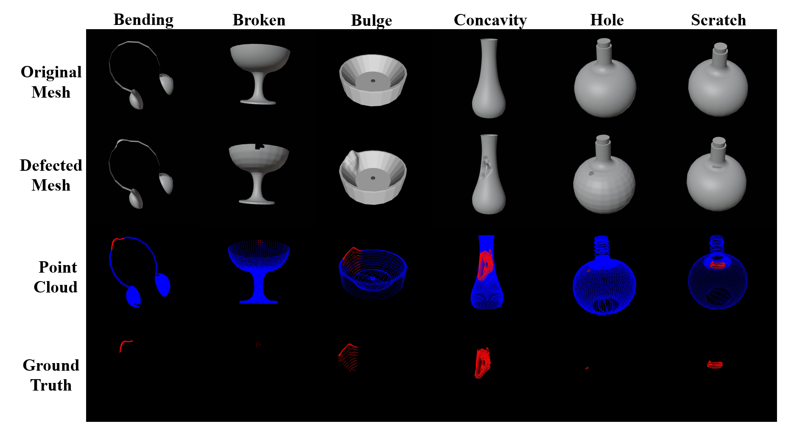

# Anomaly-ShapeNet: A Synthetic Dataset of Point Cloud Anomaly Detection

Wenqiao Li, Xiaohao Xu, Yao Gu, Bozhong Zheng, Shenghua Gao, Yingna Wu

## Introduction
This project provides a synthetic dataset for point cloud anomaly detection. We provide 3D point clouds and meshs for training and testing 3D anomaly detection algorithms.
Note that we expanded from the original 40 classes to 50 classes and put the new 10 classes in the ‘new’ folders.Our paper can be found here.[[Paper]](https://arxiv.org/abs/2311.14897)


## Data description



+ overview of Anomaly-ShapeNet

Anomaly-ShapeNet comprises a total of 1600 samples which are distributed across 40(+10) distinct categories. There are six kinds of anomalies, including bulge, concavity, crack, holes, and broken. All the obj or pcd file have been watertighted before to obtain a more smooth surface.
| Datasets | # Formats | # Category numbers  | # Anomaly types| # Train num in 1 class |  # Test num in 1 class |  # point range | # anomaly portion | 
|---|--------------|----------------|----------|-----------|-----------|-----------|-----------|
| Anomaly-ShapeNet | pcd&mesh | 50 | 6 | 4 |  15~24 | 8K~30K | 1%~7% |


## Download

+ To download our Anomaly-ShapeNet dataset (Dataset for training and evaluation, pcd&obj format), click [Anomaly-ShapeNet.zip(baidu disk: case)](https://pan.baidu.com/s/1Nm50WIU_jx5viozwe59HsQ?pwd=case)or(Google drive)(https://drive.google.com/file/d/16R8b39Os97XJOenB4bytxlV4vd_5dn0-/view?usp=sharing)


### Data preparation
- Download Anomaly-ShapeNet-v2.zip and extract into `./dataset/pcd`
```
pcd
├── ashtray0
    ├── train
        ├── *template.pcd
        ...
    ├── test
        ├── 1_bulge.pcd
        ├── 2_concavity.pcd
        ...
    ├── GT
        ├── 1_bulge.txt
        ├── 2_sink.txt
        ... 
├── bag0
...
```
## Benchmark
Our benchmark is listed in our paper[[Paper]](https://arxiv.org/abs/2311.14897) and supplymentary(https://github.com/Chopper-233/Anomaly-ShapeNet/blob/main/supp.pdf).
## Citation
Please cite the following paper if this dataset helps your project:

```bibtex
@article{liwq2024,
  title={Towards Scalable 3D Anomaly Detection and Localization: A Benchmark via 3D
Anomaly Synthesis and A Self-Supervised Learning Network},
  author={Li, Wenqiao and Xu, Xiaohao and Gu, Yao and Zheng, Bozhong and Gao, Shenghua and Wu, Yingna},
  journal={The IEEE/CVF Conference on Computer Vision and Pattern Recognition},
  year={2024}
}
```
## Thanks

Our dataset and code is built on [Real3D-AD](https://github.com/eliahuhorwitz/3D-ADS) and [M3DM](https://github.com/nomewang/M3DM), thanks for their excellent works!

## License
The dataset is released under the CC BY 4.0 license.
